# 🎰 STAVKI
## Система поиска выгодных ставок

---

# 🎯 Что это?

> **STAVKI** — умная система, которая находит ставки, где букмекер ошибся в оценке вероятности.

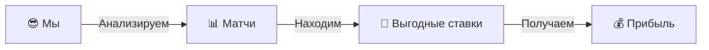

---

# 🧠 Главная идея

````carousel
## 📈 Простая математика

Если **наша вероятность** выше, чем **думает букмекер** → это **выгодная ставка**

**Пример:**
- Букмекер даёт коэффициент **2.50** (= 40% вероятность)
- Мы считаем вероятность **50%**
- Значит ставка **выгодна на 25%!**
<!-- slide -->
## 🎲 Формула успеха

**Expected Value (EV)** = Ожидаемая прибыль

```
EV = Вероятность × Коэффициент - 1
```

| EV | Значение |
|:---:|:---:|
| ✅ **> 0%** | Ставим! |
| ⚪ **= 0%** | Не ставим |
| ❌ **< 0%** | Убыток |
````

---

# 🔄 Как работает система?

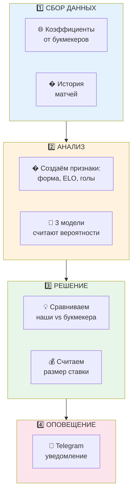

---

# 📥 Шаг 1: Сбор данных

````carousel
## 🌐 Откуда берём коэффициенты?

**The Odds API** — сервис, который собирает коэффициенты от всех букмекеров

Мы получаем:
- � Коэффициенты от **10+ букмекеров**
- ⚽ Для **6 топ-лиг** Европы
- � Обновление **каждый час**
<!-- slide -->
## 📜 Откуда берём историю?

**football-data.co.uk** — база всех матчей за 20+ лет

Мы получаем:
- ⚽ Результаты матчей
- 📅 Даты и команды
- 🥅 Забитые голы
````

---

# 🔧 Шаг 2a: Создаём признаки

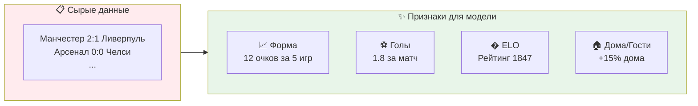

> **Признаки** — это характеристики команды, по которым модель учится предсказывать

---

# 🤖 Шаг 2b: Три модели

````carousel
## 🎯 Модель A: Пуассон

**Идея:** Голы в футболе — случайны, но предсказуемы!

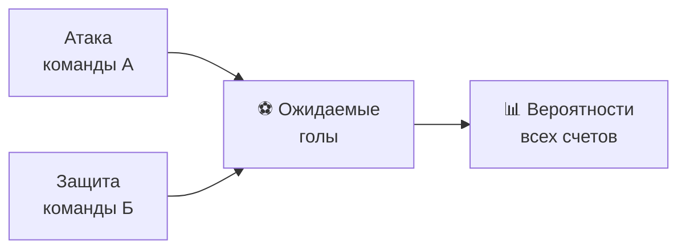

**Плюсы:** Простая, понятная, работает на "обычных" матчах
<!-- slide -->
## 🌲 Модель B: CatBoost

**Идея:** "Лес" из решающих деревьев

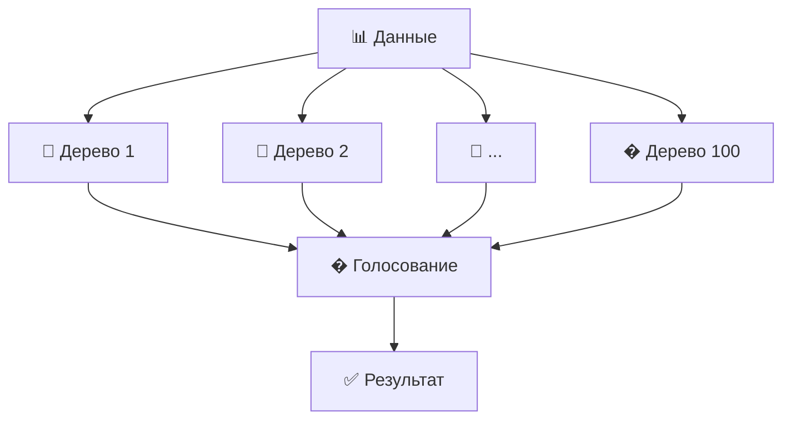

**Плюсы:** Находит сложные закономерности в данных
<!-- slide -->
## 🧠 Модель C: Нейросеть

**Идея:** Имитируем работу мозга

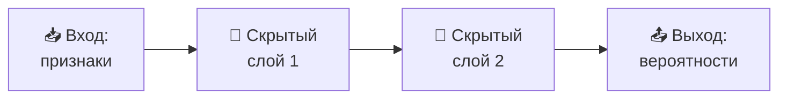

**Плюсы:** Находит нелинейные зависимости
````

---

# 🎭 Объединяем модели: Ensemble

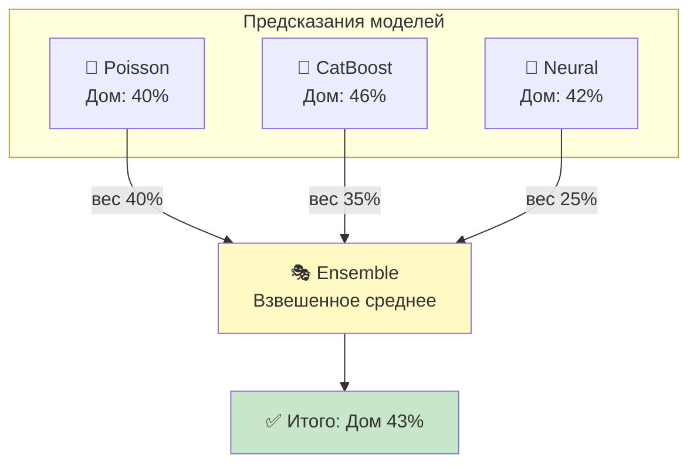

> **Ensemble** — это как совет экспертов. Каждый высказывается, и мы берём взвешенное мнение всех!

---

# 💰 Шаг 3: Считаем ставку

````carousel
## 📊 Расчёт EV (Expected Value)

**EV показывает, сколько мы заработаем в среднем**

| | Данные |
|:---|:---:|
| Наша вероятность | **45%** |
| Коэффициент | **2.50** |
| **EV** | **+12.5%** ✅ |

```
EV = 0.45 × 2.50 - 1 = +12.5%
```

Это значит: на каждые $100 мы в среднем заработаем **$12.50**
<!-- slide -->
## 💵 Расчёт размера ставки (Kelly)

**Kelly Criterion** — формула оптимального размера ставки

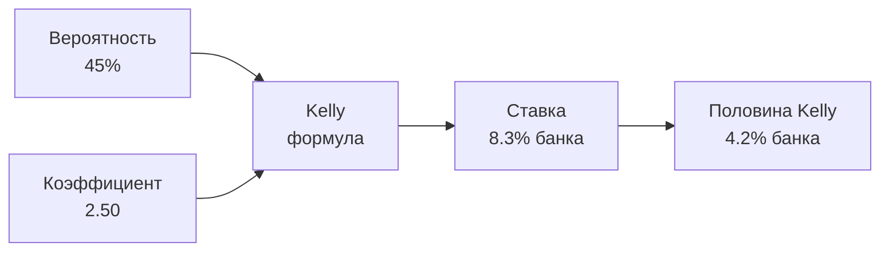

Мы используем **половину Kelly** — это безопаснее!
````

---

# 🛡️ Защита от ошибок

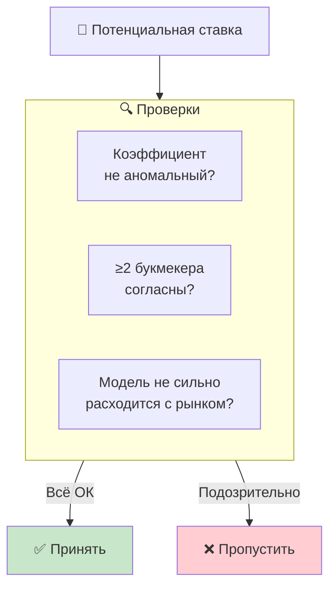

> Если один букмекер даёт 15.0, а остальные 7.0 — это **ошибка котировки**, не ставим!

---

# 📱 Шаг 4: Telegram уведомление

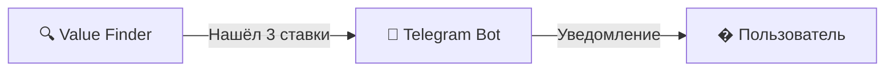

**Пример сообщения:**

> 🎯 **STAVKI Value Alert**
> 
> ⚽ **Arsenal vs Chelsea**
> ✅ Ставка: **Победа Арсенала**
> 💰 Коэфф: **2.40** (Bet365)
> 🔥 EV: **+15.2%**
> 💵 Ставка: **$42** (4.2% банка)

---

# ⏰ Автоматизация

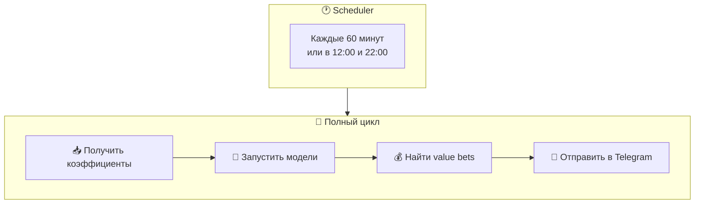

> Система работает **автоматически** — просто жди уведомлений в Telegram!

---

# 🏆 Поддерживаемые лиги

| Лига | Страна | Статус |
|:---|:---|:---:|
| ⚽ **Premier League** | 🏴󠁧󠁢󠁥󠁮󠁧󠁿 Англия | ✅ |
| ⚽ **La Liga** | 🇪🇸 Испания | ✅ |
| ⚽ **Bundesliga** | 🇩🇪 Германия | ✅ |
| ⚽ **Serie A** | 🇮🇹 Италия | ✅ |
| ⚽ **Ligue 1** | 🇫🇷 Франция | ✅ |
| ⚽ **Championship** | 🏴󠁧󠁢󠁥󠁮󠁧󠁿 Англия 2-й дивизион | ✅ |

---

# � Метрики успеха

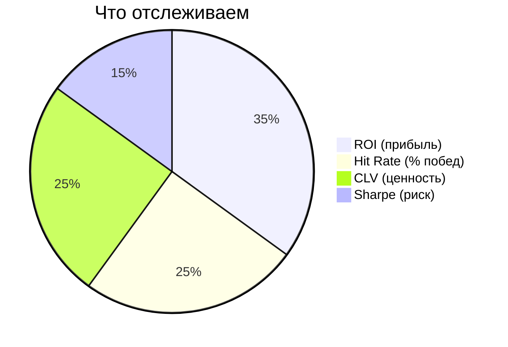

| Метрика | Что значит | Цель |
|:---|:---|:---:|
| **ROI** | Возврат инвестиций | > 5% |
| **Hit Rate** | % выигранных ставок | > 40% |
| **CLV** | Закрытие линии в нашу сторону | > 0% |

---

# 🎯 Главные выводы

````carousel
## 1️⃣ Данные = Фундамент

Мы собираем:
- 📊 Коэффициенты от **10+ букмекеров**
- 📜 История **тысяч матчей**
- 🔄 Обновление **каждый час**
<!-- slide -->
## 2️⃣ Три модели лучше одной

- 🎯 **Poisson** — классическая математика
- 🌲 **CatBoost** — современный ML
- 🧠 **Neural** — глубокое обучение

**Ensemble** объединяет их силу!
<!-- slide -->
## 3️⃣ Дисциплина = Прибыль

- ✅ Ставим только при **EV > 5%**
- 💰 Размер ставки по **Kelly**
- 🛡️ Защита от **ошибок букмекеров**
- 📱 Всё приходит в **Telegram**
````

---

# � Формула успеха

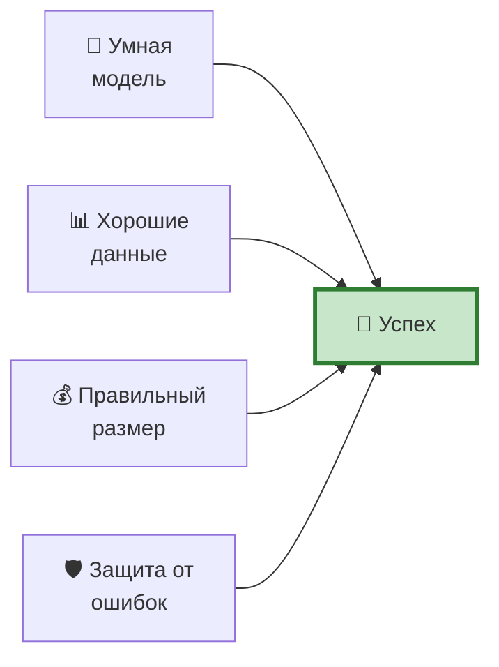

> **Value Bet** = Модель лучше рынка × Правильная ставка × Дисциплина

---

# 📞 Команды бота

| Команда | Что делает |
|:---|:---|
| `/start` | 👋 Приветствие |
| `/run` | 🔄 Запустить анализ |
| `/status` | 📊 Статус системы |
| `/time` | ⏰ До следующего запуска |
| `/set_bankroll 1000` | 💵 Установить банкролл |
| `/choose_leagues` | ⚽ Выбрать лиги |

---

# ✅ Конец

> **STAVKI** — это математика, машинное обучение и дисциплина в одной системе.

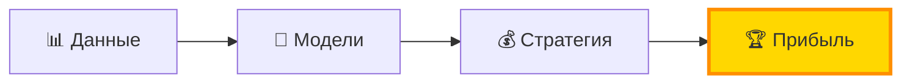
