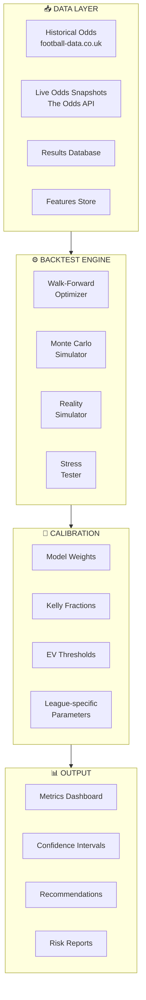
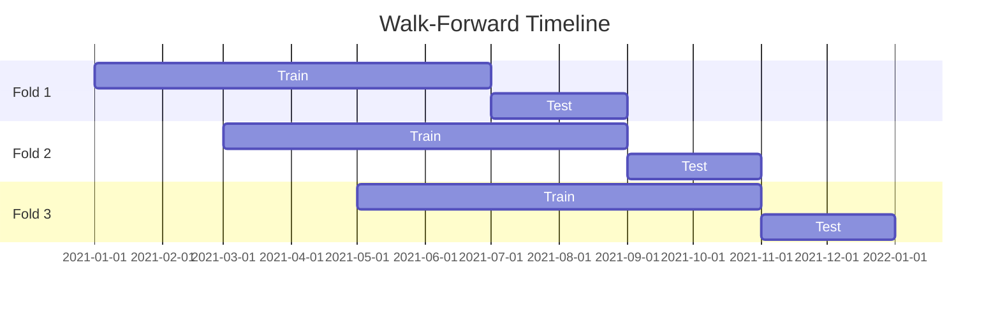
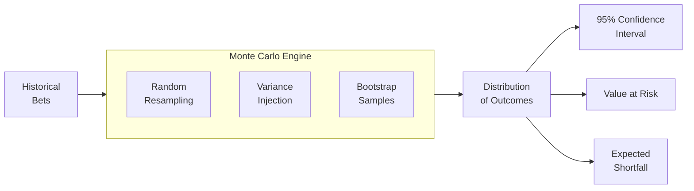
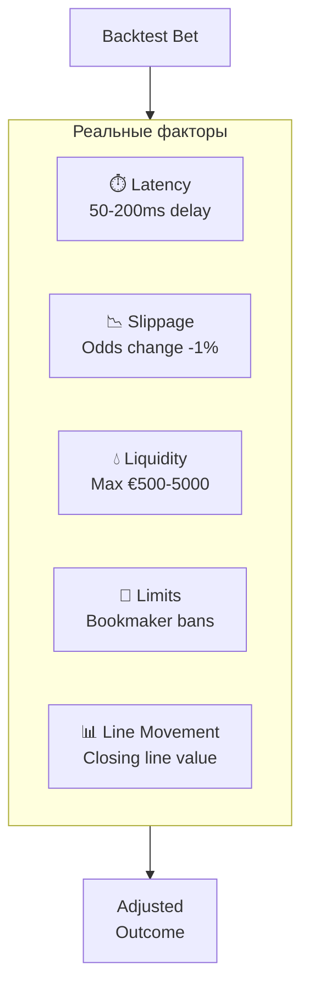
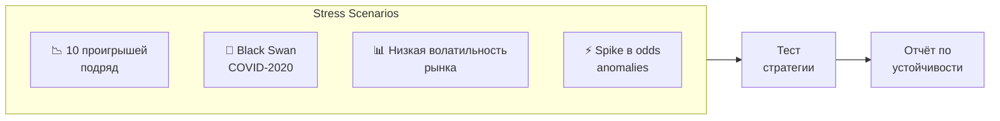
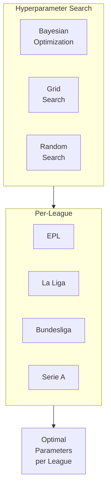
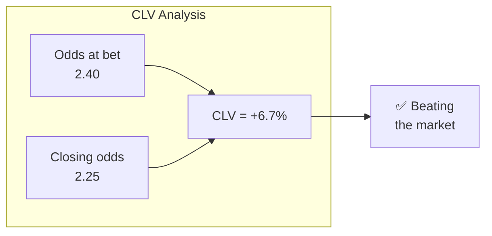
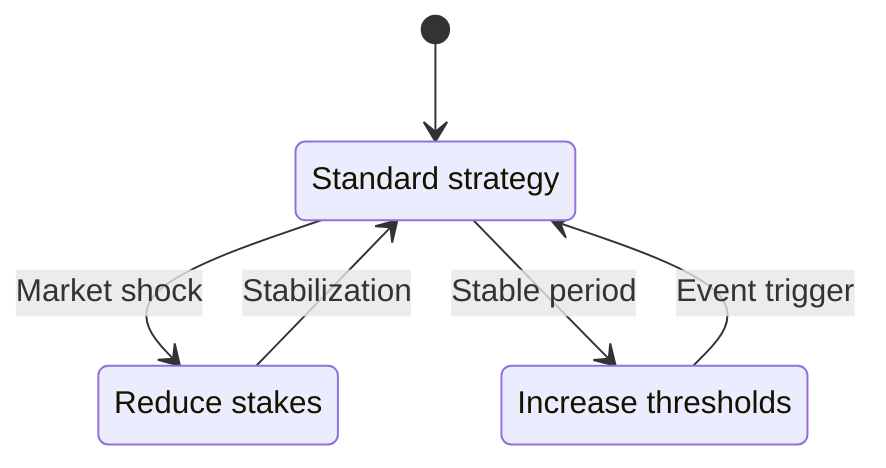
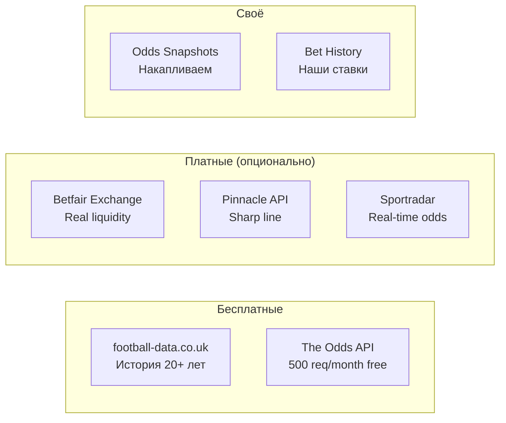

# 🧪 Ultimate Backtesting System — Design Document

> **Цель:** Создать максимально эффективную систему тестирования для калибровки всех компонентов STAVKI

---

## 🎯 Три подхода

### Подход A: **Реалистичный** (рекомендую как базу)

**Что включает:**
- Walk-Forward Optimization
- Monte Carlo симуляции
- Per-league калибровка
- CLV (Closing Line Value) tracking

**Плюсы:** Быстро реализовать, покрывает 80% потребностей
**Минусы:** Не учитывает некоторые рыночные эффекты

---

### Подход B: **Продвинутый**

**Всё из A, плюс:**
- Multi-bookmaker arbitrage detection
- Liquidity modeling (можно ли исполнить ставку?)
- Slippage simulation (коэфф изменится пока ставим)
- Correlation analysis между лигами

**Плюсы:** Намного ближе к реальности
**Минусы:** Нужны дополнительные данные

---

### Подход C: **Максималистский** (всё что возможно)

**Всё из A + B, плюс:**
- Reinforcement Learning для динамической стратегии
- Regime detection (разные рынки = разные стратегии)
- Black Swan simulation
- Real-time odds streaming backtest
- Paper trading mode с реальными API

**Плюсы:** Cutting-edge, конкурентное преимущество
**Минусы:** Сложнее, дольше

---

## ✅ Рекомендация: Подход C (Максималистский)

Раз бюджет и сложность не ограничены — берём всё!

---

# 📐 Дизайн системы

## Раздел 1: Архитектура



---

## Раздел 2: Модули системы

### 2.1 🔄 Walk-Forward Optimization

**Что это:** Тренируем на прошлом, тестируем на будущем, двигаемся вперёд по времени.



**Зачем:** Предотвращает overfitting — если модель работает на всех fold'ах, она реально работает.

**Параметры для оптимизации:**
| Параметр | Диапазон | Шаг |
|----------|----------|-----|
| `ensemble_weight_poisson` | 0.0 - 1.0 | 0.05 |
| `ensemble_weight_catboost` | 0.0 - 1.0 | 0.05 |
| `ensemble_weight_neural` | 0.0 - 1.0 | 0.05 |
| `kelly_fraction` | 0.1 - 0.5 | 0.05 |
| `min_ev_threshold` | 0.03 - 0.15 | 0.01 |
| `min_odds` | 1.3 - 2.0 | 0.1 |

---

### 2.2 🎲 Monte Carlo Simulator

**Что это:** Прогоняем 10,000+ случайных сценариев чтобы понять распределение результатов.



**Что получаем:**
- **95% CI для ROI:** "ROI будет между 3% и 12% с 95% уверенностью"
- **Value at Risk (VaR):** "С 5% вероятностью потеряем больше X"
- **Maximum Drawdown distribution:** "Типичный drawdown 15-25%"

---

### 2.3 ⚡ Reality Simulator

**Что это:** Симуляция реальных условий рынка.



**Сценарии:**
| Сценарий | Что симулируем |
|----------|----------------|
| **Optimistic** | Всё идеально |
| **Realistic** | 1-2% slippage, 100ms delay |
| **Pessimistic** | 5% slippage, limits после 50 ставок |
| **Worst Case** | 10% slippage, быстрые лимиты |

---

### 2.4 🌪️ Stress Tester

**Что это:** Проверка системы в экстремальных условиях.



**Black Swan симуляции:**
- **COVID scenario:** 3 месяца без футбола, потом резкий рестарт
- **Fixing scandal:** Внезапная аномалия в одной лиге
- **Bookmaker failure:** Один крупный букмекер закрывается
- **Model degradation:** Модель начинает ошибаться (drift detection)

---

### 2.5 🎓 AutoML Calibrator

**Что это:** Автоматический поиск оптимальных параметров для каждой лиги.



**Отдельные параметры для каждой лиги:**
```json
{
  "EPL": {
    "poisson_weight": 0.35,
    "catboost_weight": 0.40,
    "neural_weight": 0.25,
    "kelly": 0.20,
    "min_ev": 0.06
  },
  "Bundesliga": {
    "poisson_weight": 0.45,
    "catboost_weight": 0.35,
    "neural_weight": 0.20,
    "kelly": 0.25,
    "min_ev": 0.05
  }
}
```

---

### 2.6 📈 CLV Tracker (Closing Line Value)

**Что это:** Сравнение наших коэффициентов с закрывающей линией.



**Зачем:** CLV — лучший индикатор долгосрочного edge. Если постоянно бьём closing line — мы прибыльны.

**Метрики:**
- **CLV%:** Средний % выигрыша у закрывающей линии
- **CLV Hit Rate:** % ставок с положительным CLV
- **CLV by League:** CLV разбитый по лигам

---

### 2.7 🤖 Regime Detector

**Что это:** Определение "режима" рынка для адаптации стратегии.



**Режимы:**
| Режим | Характеристики | Действие |
|-------|----------------|----------|
| **Normal** | Обычная волатильность | Стандартная стратегия |
| **High Volatility** | Много движения линий | Уменьшить Kelly |
| **Low Edge** | Рынок эффективен | Повысить EV threshold |
| **Opportunity** | Много value | Увеличить exposure |

---

## Раздел 3: Метрики и Dashboard

### Основные метрики

| Метрика | Описание | Цель |
|---------|----------|------|
| **ROI** | Return on Investment | > 5% |
| **Sharpe Ratio** | Risk-adjusted return | > 1.0 |
| **Max Drawdown** | Максимальная просадка | < 25% |
| **Win Rate** | % выигранных ставок | > 40% |
| **CLV** | Closing Line Value | > 2% |
| **Kelly Efficiency** | Реальный vs теоретический Kelly | > 80% |

### Продвинутые метрики

| Метрика | Описание |
|---------|----------|
| **Calmar Ratio** | ROI / Max Drawdown |
| **Sortino Ratio** | Return vs downside deviation |
| **Recovery Factor** | Profit / Max Drawdown |
| **Profit Factor** | Gross profit / Gross loss |
| **Expected Shortfall** | Average loss in worst 5% scenarios |

---

## Раздел 4: Данные и инфраструктура

### 4.1 Источники данных



### 4.2 Snapshot Collection System

**Идея:** Каждый час сохраняем коэффициенты → через год у нас миллионы точек данных.

```python
# Структура снапшота
{
    "timestamp": "2024-01-15T14:00:00Z",
    "event_id": "epl_manu_liv_2024",
    "bookmakers": {
        "bet365": {"home": 2.40, "draw": 3.20, "away": 3.00},
        "pinnacle": {"home": 2.38, "draw": 3.25, "away": 2.98},
        ...
    },
    "time_to_kickoff_hours": 24
}
```

---

## Раздел 5: Plan реализации

### Phase 1: Foundation (1-2 недели)

- [ ] **BacktestEngine class** — Базовый движок
- [ ] **DataLoader** — Унифицированная загрузка данных
- [ ] **MetricsCalculator** — Все метрики в одном месте
- [ ] **Walk-Forward Validator** — Базовая версия

### Phase 2: Simulation (2-3 недели)

- [ ] **MonteCarloSimulator** — 10K+ симуляций
- [ ] **RealitySimulator** — Slippage, latency, limits
- [ ] **StressTester** — Black swan scenarios
- [ ] **CLVTracker** — Closing line analysis

### Phase 3: Optimization (2-3 недели)

- [ ] **AutoCalibrator** — Bayesian optimization
- [ ] **PerLeagueOptimizer** — Отдельные параметры для лиг
- [ ] **RegimeDetector** — Market regime classification
- [ ] **EnsembleWeightOptimizer** — Оптимизация весов моделей

### Phase 4: Dashboard & Integration (1-2 недели)

- [ ] **MetricsDashboard** — Визуализация результатов
- [ ] **ConfidenceReporter** — Confidence intervals
- [ ] **Integration with production** — Auto-update parameters
- [ ] **Paper Trading Mode** — Тест на реальных данных без денег

---

## 📊 Ожидаемые результаты

После внедрения системы мы получим:

| Возможность | Польза |
|-------------|--------|
| **Оптимальные веса по лигам** | +2-5% ROI |
| **Правильный Kelly** | Меньше drawdown |
| **CLV tracking** | Proof of edge |
| **Stress testing** | Готовность к Black Swan |
| **Confidence intervals** | Знаем реальные риски |
| **Auto-recalibration** | Адаптация к изменениям рынка |

---

## ⚠️ Вопросы для обсуждения

1. **Приоритет фаз** — Начинаем с Phase 1 последовательно или параллелим?

2. **Платные данные** — Готов ли инвестировать в Pinnacle/Betfair API для более точных данных?

3. **Paper Trading** — Хочешь режим "виртуальных ставок" для тестирования в реальном времени?

4. **Dashboard** — Нужен ли веб-интерфейс или достаточно CLI + JSON отчётов?
