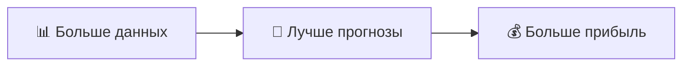
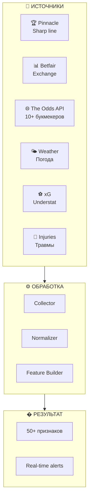
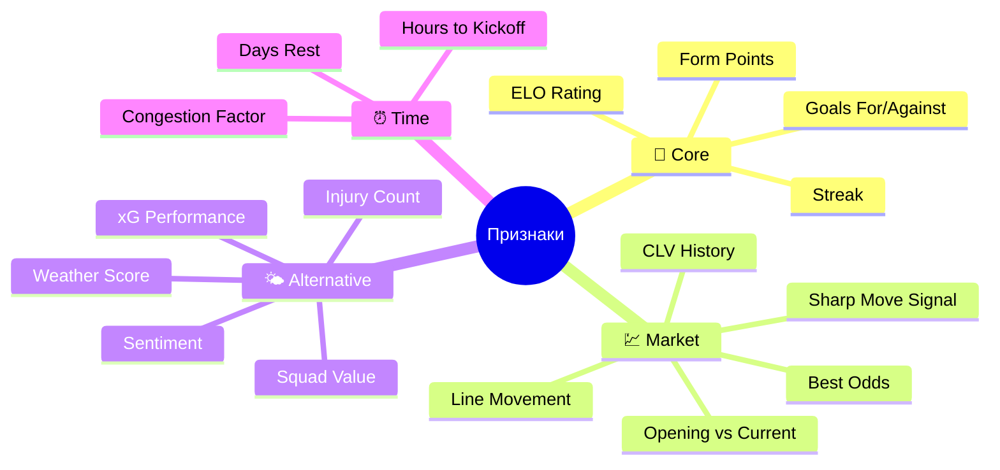
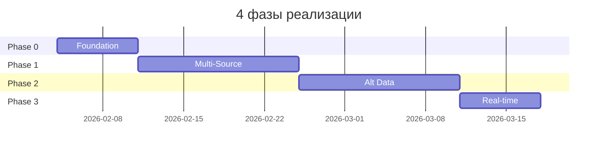
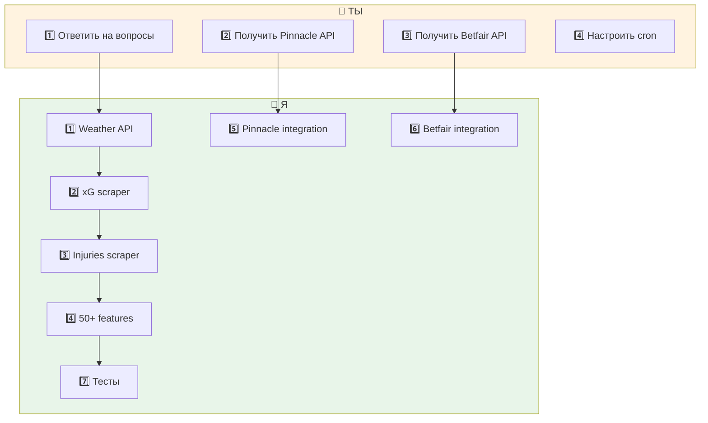

# 🚀 Ultimate Data Pipeline
## Максимально мощная система сбора данных для STAVKI

---

# 🎯 Цель

> Создать **идеальную** систему получения и обработки данных, которая даст нам **конкурентное преимущество** над рынком.



---

# 📊 Текущее состояние

````carousel
## ✅ Что уже есть

| Компонент | Статус |
|:---|:---:|
| The Odds API | ✅ |
| ELO рейтинги | ✅ |
| Форма команд | ✅ |
| Line Movement | ✅ |
| CLV Tracking | ✅ |
| Sentiment (базовый) | ✅ |
<!-- slide -->
## ❌ Чего не хватает

| Возможность | Статус |
|:---|:---:|
| Pinnacle (sharp line) | ❌ |
| Betfair (liquidity) | ❌ |
| Weather данные | ❌ |
| xG статистика | ❌ |
| Реальные травмы | ❌ |
| Real-time обновления | ❌ |
````

---

# 🌐 Новая архитектура



---

# 📡 Новые источники данных

````carousel
## 🏆 Pinnacle — "Правда рынка"

**Что это:** Самый острый букмекер в мире

**Зачем нужен:**
- Его closing line = истинная вероятность
- CLV бенчмарк
- Если бьём Pinnacle → мы прибыльны

**Стоимость:** ~$50/месяц
<!-- slide -->
## 📊 Betfair Exchange

**Что это:** Биржа ставок (люди ставят друг против друга)

**Зачем нужен:**
- Реальная ликвидность (можно ли исполнить ставку?)
- Нет маржи букмекера
- Истинные рыночные вероятности

**Стоимость:** Бесплатный API
<!-- slide -->
## 🌤️ Weather API

**Что это:** Погодные данные для матча

**Зачем нужен:**
- Дождь → меньше голов
- Ветер → меньше точных передач
- Экстремальная погода → больше ничьих

**Стоимость:** Бесплатно (OpenWeatherMap)
<!-- slide -->
## ⚽ xG Data (Expected Goals)

**Что это:** Ожидаемые голы на основе качества моментов

**Зачем нужен:**
- Лучше предсказывает будущее чем actual goals
- Выявляет over/under performers
- Regression to mean

**Стоимость:** Бесплатно (Understat scraping)
<!-- slide -->
## 🏥 Injury & Lineup Data

**Что это:** Актуальные данные о травмах и составах

**Зачем нужен:**
- Отсутствие звезды = -10% силы команды
- Last-minute lineup changes
- Edge за минуты до матча

**Стоимость:** Бесплатно (FotMob scraping)
````

---

# 🔧 50+ признаков



---

# 💰 Ожидаемый результат

| Улучшение | Прирост ROI |
|:---|:---:|
| � Pinnacle CLV tracking | **+2-3%** |
| 🌤️ Weather features | **+0.5-1%** |
| ⚽ xG features | **+1-2%** |
| ⚡ Real-time odds | **+1-2%** |
| 🏥 Lineup data | **+0.5-1%** |
| 📊 Multi-bookmaker | **+1-2%** |
| **ИТОГО** | **+6-11%** |

---

# 🗓️ План реализации



---

# 👥 Разделение обязанностей

## 🤖 Что сделаю Я (Antigravity):

| Задача | Время |
|:---|:---:|
| ✅ Интеграция Weather API | 2 часа |
| ✅ Understat scraper для xG | 3 часа |
| ✅ FotMob scraper для травм | 3 часа |
| ✅ Upgrade feature extractor (50+ признаков) | 4 часа |
| ✅ Улучшение snapshot collector | 2 часа |
| ✅ Multi-bookmaker best price selector | 2 часа |
| ✅ Тесты для всех новых модулей | 3 часа |

---

## 👤 Что нужно сделать ТЕБЕ:

````carousel
## 1️⃣ Pinnacle API

**Действие:** Зарегистрироваться на Pinnacle

**Шаги:**
1. Создать аккаунт на [pinnacle.com](https://www.pinnacle.com)
2. Подать заявку на API доступ
3. Получить API key и secret
4. Передать мне credentials

**Стоимость:** ~$50/месяц
**Время:** 1-2 дня на одобрение
<!-- slide -->
## 2️⃣ Betfair API

**Действие:** Получить Betfair Exchange API

**Шаги:**
1. Создать аккаунт на [betfair.com](https://www.betfair.com)
2. Зайти в Developer Portal
3. Создать Application Key
4. Передать мне API key

**Стоимость:** Бесплатно
**Время:** 10 минут
<!-- slide -->
## 3️⃣ Настроить Cron

**Действие:** Запустить автоматический сбор данных

**Шаги:**
1. Я напишу скрипт
2. Ты настроишь cron на сервере:
```bash
# Каждые 30 минут
*/30 * * * * python collect_all_data.py
```

**Стоимость:** Бесплатно
**Время:** 5 минут
<!-- slide -->
## 4️⃣ Решения по вопросам

**Нужны ответы:**

1. **Pinnacle** — Готов платить ~$50/месяц?
   - [ ] Да
   - [ ] Нет, только бесплатное

2. **Betfair** — Нужен?
   - [ ] Да
   - [ ] Нет

3. **Storage** — Оставить SQLite или upgrade?
   - [ ] SQLite (просто)
   - [ ] TimescaleDB (мощно)
````

---

# 🚦 Порядок работ



---

# ⏭️ Следующий шаг

> Ответь на вопросы выше, и я начну реализацию!

**Вопросы:**

1. 🏆 **Pinnacle API** (~$50/месяц) — Да/Нет?

2. 📊 **Betfair API** (бесплатно) — Да/Нет?

3. 💾 **Storage upgrade** — SQLite или TimescaleDB?

4. ⚡ **Real-time** — 5 минут достаточно или нужен WebSocket?

---

# ✅ После твоих ответов

Я сразу начну с того, что **не требует твоего участия:**

1. ✅ Weather API интеграция
2. ✅ xG Understat scraper  
3. ✅ Injuries FotMob scraper
4. ✅ 50+ feature extractor
5. ✅ Тесты

**Параллельно** ты получаешь API ключи, и когда они будут готовы — я их интегрирую.
