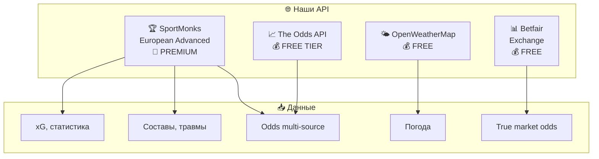
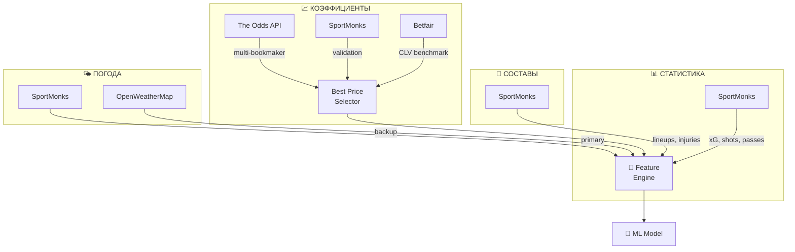
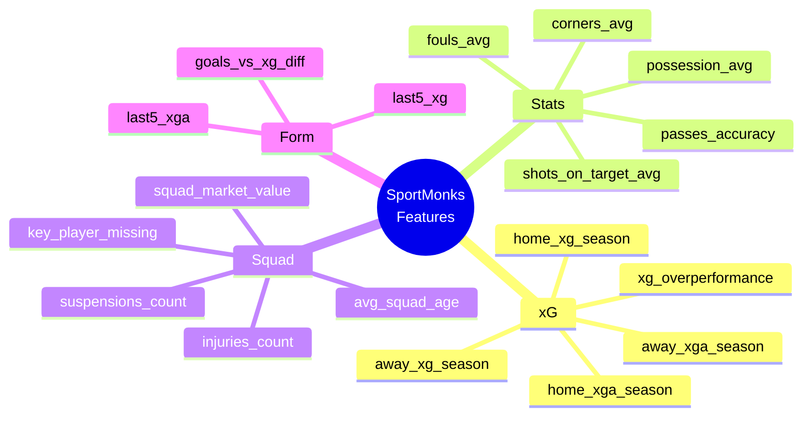
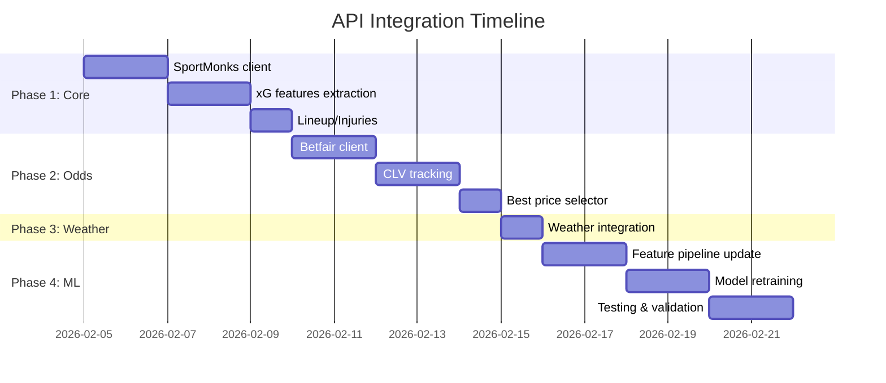

# 🔌 API Integration Master Plan
## SportMonks + Betfair + OpenWeatherMap + The Odds API

---

# 🎯 Что у нас есть



---

# 📊 Разбор каждого API

````carousel
## 🏆 SportMonks European Advanced

**Это наш ГЛАВНЫЙ источник!**

| Возможность | Что даёт модели |
|:---|:---|
| **xG Data** | Expected goals — лучше чем actual goals |
| **99+ статистик** | Shots, passes, possession, etc. |
| **Lineups** | Составы перед матчем |
| **Injuries** | Травмы и дисквалификации |
| **Odds** | Pre-match и in-play |
| **Predictions** | Их прогнозы (для сравнения) |
| **Transfers** | Трансферы и слухи |
| **Weather forecast** | Прогноз погоды! |

**27 европейских лиг включая:**
- Premier League, La Liga, Bundesliga
- Serie A, Ligue 1, Championship
- И ещё 20+ лиг
<!-- slide -->
## 📊 Betfair Exchange

**Для чего использовать:**

| Функция | Польза |
|:---|:---|
| **True odds** | Без маржи букмекера |
| **Historical data** | Для backtesting |
| **Volume/Liquidity** | Сколько денег на рынке |
| **Sharp line** | Биржа = истина рынка |

**CLV Benchmark:**
- Betfair closing = "правда"
- Если наши ставки бьют closing → мы прибыльны
<!-- slide -->
## 🌤️ OpenWeatherMap

**Для чего использовать:**

| Данные | Влияние на матч |
|:---|:---|
| **Дождь** | Меньше голов, больше ничьих |
| **Ветер** | Меньше точных передач |
| **Температура** | Экстремальная → усталость |
| **Влажность** | Влияет на темп игры |

**Но!** SportMonks УЖЕ включает weather forecast!
→ OpenWeatherMap = backup/validation
<!-- slide -->
## 📈 The Odds API

**Для чего использовать:**

| Функция | Польза |
|:---|:---|
| **10+ букмекеров** | Best price hunting |
| **Pinnacle odds** | Sharp line benchmark |
| **Fast updates** | Быстрее чем SportMonks |

**Стратегия:**
- The Odds API = основной для odds
- SportMonks odds = backup/validation
````

---

# 🎯 Стратегия использования



---

# 📋 Матрица: Что откуда брать

| Данные | Основной источник | Backup | Зачем backup |
|:---|:---|:---|:---|
| **xG, статистика** | SportMonks | — | Единственный источник |
| **Lineups** | SportMonks | — | Единственный источник |
| **Injuries** | SportMonks | — | Единственный источник |
| **Odds (betting)** | The Odds API | SportMonks | Больше букмекеров |
| **CLV benchmark** | Betfair | Pinnacle via Odds API | True market |
| **Weather** | SportMonks | OpenWeatherMap | Validation |
| **Historical odds** | Betfair | The Odds API snapshots | Backtesting |

---

# 🔧 Новые признаки (Features)

## Из SportMonks (+30 features):



## Из Betfair (+5 features):

| Feature | Описание |
|:---|:---|
| `betfair_home_odds` | True market odds |
| `betfair_volume_home` | Liquidity |
| `odds_vs_betfair_diff` | Gap от истины рынка |
| `betfair_movement_24h` | Движение за 24ч |
| `market_confidence` | Volume / total volume |

## Из Weather (+5 features):

| Feature | Описание |
|:---|:---|
| `temperature` | Celsius |
| `precipitation` | mm/hour |
| `wind_speed` | km/h |
| `humidity` | % |
| `weather_score` | Composite 0-1 |

---

# 📅 План реализации



---

# 👥 Разделение работ

## 👤 Что нужно ОТ ТЕБЯ:

| Задача | Время | Когда |
|:---|:---:|:---|
| **SportMonks API key** | 1 мин | Сейчас |
| **Betfair credentials** | 5 мин | Сейчас |
| **OpenWeatherMap key** | 2 мин | Сейчас |
| **Подтвердить план** | 5 мин | После прочтения |

---

## 🤖 Что сделаю Я:

### Phase 1: SportMonks Integration (3-4 дня)
- [ ] `SportMonksClient` — API клиент
- [ ] `XGFeatureExtractor` — извлечение xG данных
- [ ] `LineupTracker` — отслеживание составов
- [ ] `InjuryMonitor` — мониторинг травм
- [ ] Тесты для всего

### Phase 2: Odds Integration (3-4 дня)
- [ ] `BetfairClient` — клиент биржи
- [ ] `CLVTracker` — отслеживание CLV
- [ ] `BestPriceSelector` — поиск лучшей цены
- [ ] Интеграция с существующим The Odds API

### Phase 3: Weather (1 день)
- [ ] `WeatherEnricher` — добавление погоды
- [ ] Fallback на OpenWeatherMap

### Phase 4: ML Pipeline Update (4 дня)
- [ ] Обновление `LiveFeatureExtractor` (50+ features)
- [ ] Ретрейнинг моделей на новых данных
- [ ] A/B тест старые vs новые features
- [ ] Валидация улучшения ROI

---

# 💰 Ожидаемый Impact

| Источник | Новые features | Ожидаемый ROI boost |
|:---|:---:|:---:|
| **SportMonks xG** | +10 | **+2-3%** |
| **SportMonks lineups** | +5 | **+1-2%** |
| **Betfair CLV** | +5 | **+1-2%** |
| **Weather** | +5 | **+0.5-1%** |
| **Best price** | — | **+1-2%** |
| **ИТОГО** | **+25 features** | **+5.5-10% ROI** |

---

# ⏭️ Следующий шаг

> Скинь мне API ключи, и я начну реализацию Phase 1!

**Нужно:**
1. 🏆 **SportMonks API Key**
2. 📊 **Betfair App Key + Session Token**
3. 🌤️ **OpenWeatherMap API Key**

---

# ❓ Вопросы перед стартом

1. **Частота обновления данных?**
   - [ ] Каждый час (экономит API calls)
   - [ ] Каждые 30 мин (баланс)
   - [ ] Каждые 15 мин (максимум)

2. **Хранение данных?**
   - [ ] SQLite (просто, уже есть)
   - [ ] PostgreSQL (надёжнее)
   - [ ] TimescaleDB (для time-series)

3. **Приоритет лиг?**
   - [ ] Только Big 5 (EPL, La Liga, Bundesliga, Serie A, Ligue 1)
   - [ ] Big 5 + Championship
   - [ ] Все 27 европейских лиг
